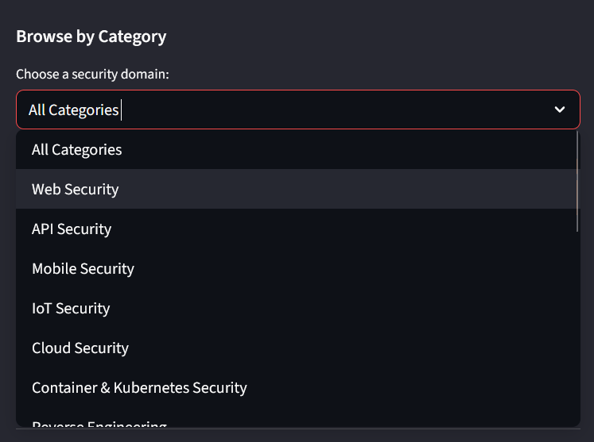
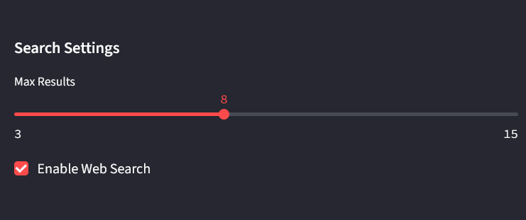
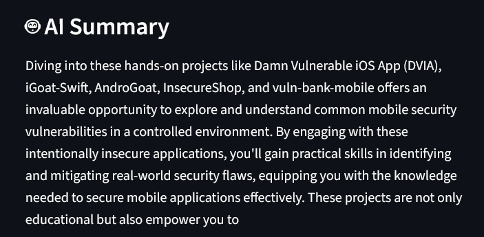
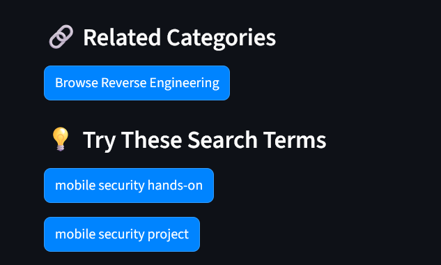
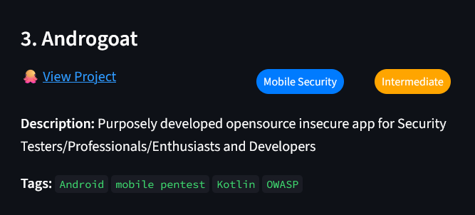

Lately, I've been learning new things, mostly around to AI and programming, and also trying to build more projects that's helpful to me and others in the cybersecurity community. 

This post is about [HackList](https://github.com/abigailajohn/HackList), my latest project. HackList helps you discover cybersecurity hands-on projects, practice labs, vulnerable machines related to your field of interest. So, if you're looking to improve your API hacking skills, you can use HackList to find projects like VVMA, VulnBank, crAPI and more. 

## 🌟The Story

As I mentioned earlier, one of my goals is to build more projects to help both myself and others in the community. I have a personal reason for this and I believe a lot of people, mostly those who are new to the field, can relate. 

Towards the end of last year, I started learning about mobile hacking. I was taking a course that had a few vulnerable apps for each section that I could practice with. The platform name is [Hextree](https://www.hextree.io/) in case you're curious. But outside what the course offered, I wanted more. I searched, but I couldn't find that much labs or so. 

This isn't actaully how I got the idea for HackList. I'm just sharing because like I said, this is a pain a lot of us can relate to. Sometimes, we struggle to find these resources, our research skills might not be that great, which makes it even more difficult. 

With the rise of AI agents and more, I thought of building agentic cybersecurity projects. I did my research, and came up with a list of simple project ideas. Some that could help the community and some that could help  organizatons. Yep! For the community-focused ideas, they had to be simple with less resources required. And by resources I mean time and money. That's how I settled with the "cybersecurity project recommender" idea. 

After agreeing on what to build, I started building. I had taken a few courses already and built a few agents, some that worked, while some failed to work. (I'll share a post soon on building an AI agent, just something short and easy to follow so stay tune if you're interested!)

I feel this post is long. Haha

That's it for the intro and backstory. Next I'll cover the tech stack, the features, show a demo, maybe share future plans and then we say our goodbyes. 

## 🌟 Tech Stack:
I didn't spend much time deciding the tech to use. Like I said, I considered the resources, my programming skills and what I was already comfortable using.
```shell
Python
OpenAI API
Streamlit
Serper API
Docker
Github
```
- Python: Used for the backend logic and agent orchestration
- Streamlit: for the web interface. This was easy to setup, so I thought to use it. 
- OpenAI API: powers the AI recommendations and generats project summaries.
- Serper API: for performing web searches. 
- Docker: for containerizing the application
- GitHub: for version control  and project hosting

### 🌟 Core Features
HackList has a simple goal which is to make to make it eaiser to find relevant hands-on projects. It's your go-to AI-powered guide to cybersecurity learning.

These are the key features:
```shell
 🤖 AI-Powered Recommendations: understands your interests and finds relevant projects. 
 🔍 Multi-Source Search: searches different sources, mostly GitHub, for these projects. 
 📚 Preloaded Dataset: provides recommendations from a built-in list of cybersecurity projects. 
 🏷️ Personalized Results: suggestions are based on your specific interests and chosen categories.
 🖥️ User-Friendly Interface: Streamlit web app for easy interaction
```

### Other features:
- Browse by Category: explore projects by selectiing a category from the sidebar. 
<div align="center"></div>

- Search Settings: Control the maximum number of results and toggle web search on/off. 
<div align="center"></div>

- AI Summary: Get AI generated summaries explaining the purpose and learning value of each project. 
<div align="center"></div>

- Related Categories & Suggestions: Suggests related security fields and alternative search terms to help you discover more projects.
<div align="center"></div>

- Project Details: Display project name, description, difficulty level (beginner, intermidiate, beginner), tags, and direct links.
<div align="center"></div>

These features are what makes HackList what it is. Though it's not %100 perfect, I'll keep on improving it with time to make it more accurate with relevant features. 

### Demo
We know the tech and features, but does it actually work? That's what this section is about. The video below shows exactly how HackList works: 
<div align="center"><video controls  width="400" src="../assets/videos/hacklistdemo.mp4"  title="HackList Demo"></video></div>

The demo sums up HackList, and shows you how to go about using it.

## 🧠 A Key Lesson Learned
While I'm still learning how to build AI tools, HackList is my first fully completed AI project that I've made public. 

Each stage of the project taught me something new, but a key takeway from this experience is: *just start*. It doesn't matter, the journey is not always smooth and your skills don't need to be perfect. My programming skills aren't at 100% and I'd just started building agents.
In fact, I was taking the HuggingFace course on building AI agents, and at the task where I had to "build my first agent" (which actually wasn't my first), I built it, but it didn't run because I ran out of tokens. Instead of buying more tokens, I said, "Why not build *"HackList" using my OpenAI API?,"* And that's how HackList was born.

If I hadn't faced that challenge, I wouldn't have worked on HackList. Some things do happen for a reason. 

So, maybe seize every opportunity to do something. It doesn't have to be coding, it could be anything that brings you close to your goals.

## 🚀 Launch Outcome
After the completing the project, I used Docker to containerize it (deploy). The GitHub repo has installation guidelines. You'll need your own openAI API and Serper API keys because, for now, I can only cover them for myself. 

I annouced the project on LinkedIn and Twitter(X). We're still at the early stages, but I'll share more updates soon. Right now, HackList has 12 stars on GitHub which is encouraging and thank you to everyone supporting the project!

## 🔮 What's Next?

I'll continue adding more to HackList. 

This project is open to suggestions, contributions and collaborations. 

If you'd like to contribute, feel free to jump in and help make HackList better. 

As I get more ideas and resources, I'll definetly keep improving it.

## 💭 Final Thoughts

Like I always say, this is just the beginning. I love to challenging myself and building things. 

I'm excited to keep learning, building, and sharing with the cybersecurity community. 

Thanks for reading, don't forget to check out the project and leave a star.

### 🔗 Useful Links

- 👉 [Check out HackList on GitHub](https://github.com/abigailajohn/HackList)
- [Read the article on setting up HackList](https://chisom.hashnode.dev/hacklist-doc-ai-powered-cybersecurity-project-guide) 

